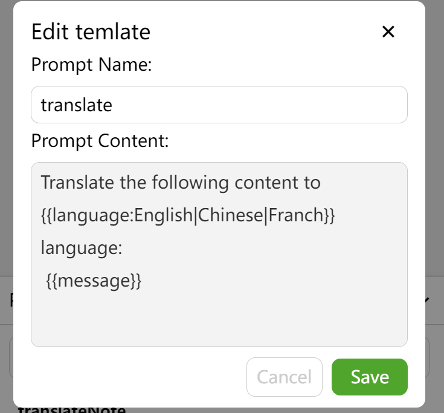
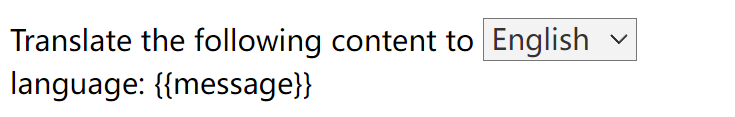
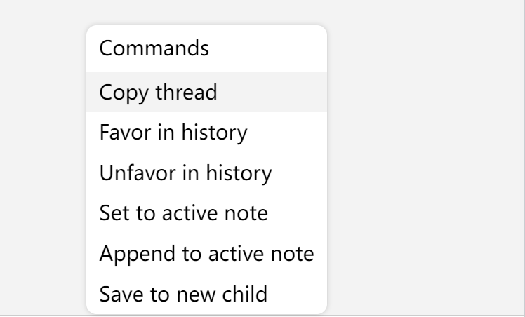
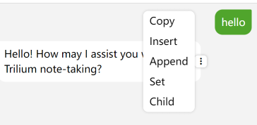
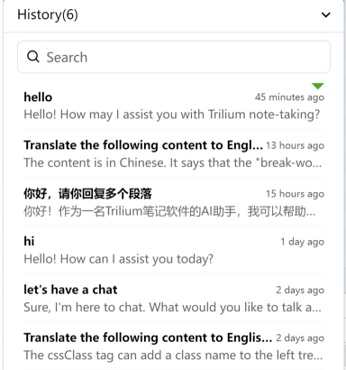

# Trilium-chat

## Introduction

The chat plugin for Trilium currently supports Chatgpt.

This project is written in vanilla JavaScript, and is a frontend-only project. For those interested in developing Trilium plugins, there are some details within that can be referenced.

## Features

-   Normal chat
-   Custom prompt
    -   Supports mustache syntax to render options. e.g. {{language:Enligsh|Chinese|Czech}} will be rendered as a select element (This can be changed in CHAT_PROMPTS) 
    -   {{message}} as your message
    -   {{activeNote}} as the content of active note 
-   Commands
    -   Copy
    -   Save to history
    -   Favor
    -   Save to active note
    -   Append to active note
    -   Save to new child note
    -   Insert(for message)
-   Automatic history saving
-   Supports light and dark themes

## Preview

https://soulsands.github.io/trilium-chat/

After you save your Chatgpt apikey and refresh the page, You can use most of the features, except those that depend on Trilium.

Please feel free to experience this page as it directly calls the ChatGPT API.

## Start

1. Create a JS frontend note then copy the contents from the release file "main.js" into the note, or alternatively, import the 'main.js' file.
2. Set the note with `#run=frontendStartup `
3. Reload. An options note will be created as a child of the script note.
4. Configure your ChatGPT API key and reload.


## Documentation

### OPTIONS

Options is stored in a JSON note with `#CHAT_OPTIONS ` label.

| OPTION        | Description                                                  | Default                                                      |
| ------------- | ------------------------------------------------------------ | ------------------------------------------------------------ |
| viewWidth     | Width of the chat interface, can be adjusted directly by dragging the left side | 400                                                          |
| engine        | AI provider that powers the chat, currently only supports ChatGPT | chatGpt                                                      |
| apiKey        | API key for chatGPT, check it [here](https://platform.openai.com/account/api-keys) | ‘’                                                           |
| requestUrls   | URLs used for requests, currently only supports completion, other functionalities are not yet implemented | { completion: 'https://api.openai.com/v1/chat/completions'}, |
| engineOptions | [Request parameters](https://platform.openai.com/docs/api-reference/completions/create) for chatGPThttps://platform.openai.com/docs/api-reference/completions/create) | {<br/>        model: 'gpt-3.5-turbo',<br/>        max_tokens: 2500,<br/>        temperature: 0.3,<br/>        top_p: 1,<br/>        presence_penalty: 0.5,<br/>        frequency_penalty: 0.5,<br/>        stream: true,<br/>        n: 1,<br/>    } |
| shortcut      | Keyboard shortcuts for controlling chat display              | {<br/>        toggle: 'Alt+Q',<br/>        hide: 'Esc',<br/>    } |
| faces         | Randomly displayed facial expressions in the top left corner, using class names from the Trilium icon library | [<br/>        'bx-smile',<br/>        'bx-wink-smile',<br/>        'bx-face',<br/>        'bx-happy-alt',<br/>        'bx-cool',<br/>        'bx-laugh',<br/>        'bx-upside-down',<br/>       ], |
| colors        | Colors of the randomly displayed facial expressions          | ['var(--muted-text-color)']                                  |
| autoSave      | Whether to automatically save the conversation history, if set to false, a save command will be displayed in the command list. | true                                                         |
| systemPrompt  | Background prompt used for system messages, e.g., set it to: "You are a helpful assistant for Trilium note-taking." | ‘’                                                           |
| checkUpdates  | Whether to automatically check for updates. If enabled, a dot will be displayed on the face icon when an update is available. | true                                                         |

### Prompt

The prompt supports customizable options, making it highly flexible to use.



The `{{language:English|Chinese|French}}` will be rendered as a dropdown component, allowing you to select the desired option directly when using it.



`{{activeNote}}` supports two types of messages: text and code. For text messages, the content will be rendered in the chat window as it appears in the note, with one exception - if it is an included note, it will be rendered as a link.

It is important to note that because Trilium stores text notes in HTML format, messages sent through `{{activeNote}}` will also be sent in HTML format. This is to provide AI with more information. The prompt can specify how the response should be formatted.

When using `{{activeNote}}`, AI may return HTML, but it will still be rendered as plain text because it is difficult to determine whether the returned HTML is formatting information or actual code. Markdown is easier to handle, and support for markdown rendering may be added in the future.

Prompts will be stored under the `#CHAT_PROMPTS` note. You can manually modify the order or content within it.

### Command

#### thread 



The `favor` command will prioritize the entry in the chat history and display a flag indicating its importance.

The `set` command replaces the current note with the chat content.

The `append` command inserts the current note at the end of the note. 

#### message



Introducing a new command, `insert`, which allows you to insert the current message at the selected position of the cursor. 

The `set`, `insert`, and `append` commands support both text and code note types. 

### History



The chat history will be stored under the note labeled with `CHAT_HISTORY_HOME`. If such a note doesn't exist, it will be stored under the default "trilium-chat" note.

When opening the history or prompts, the search bar will be focused by default. You can navigate through the options using the Tab and Shift+Tab keys, and select an option by pressing Enter.

## TODO

-   [ ] operation shortcut
-   [ ] new bing

## Contribute

```js
yarn
//create .env.dev
yarn dev

// create .env.triliumTest
yarn build:test "{{temp file path}}" ## use open note externally/custom to create a temporary file
```

This project is developed using vanilla JavaScript, making it simple and easy to understand.

Any contributions would be appreciated. If you have any questions or comments, please feel free to reach out to me.

## Shoutout

[Trilium](https://github.com/zadam/trilium)

Grateful to zadam for developing Trilium and making it open source.

---

That you've reached this point shows you have enough interest in this project. If you find it helpful, please consider giving it a star. Your support will motivate me to further improve it.

This readme was translated by ChatGPT, and thanks to ChatGPT as well.

