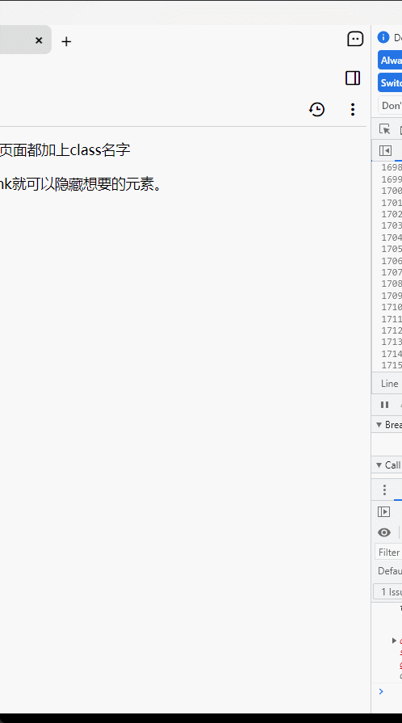

# trilium-chat

## Introduction

The chat plugin for Trilium currently supports Chatgpt 


## Start

1. Create a JS frontend note with the label `"#run=frontendStartup"`.
2. Copy the contents from the release file "main.js" into the note.
3. Reload. An options note will be created as a child of the script note.
4. Configure your ChatGPT API key and reload.

## Features 

- Normal chat
- Custom prompt
  - Supports mustache syntax to render options. e.g. {{languague:chinese|English|Franch}} will be rendered as a select element
  - {{message}} as your message
  - {{activeNote}} as the content of active note
- Commands
  - Copy
  - Save to history
  - Favorite history
  - Save to active note
  - Append to active note
  - Save to new child note
- Automatic history saving
- Supports light and dark themes


## TODO

- [ ] per message command
- [ ] self upgrade
- [ ] prompts market
- [ ] operation shortcut


## DEMO

https://soulsands.github.io/trilium-chat/

After save your Chatgpt apikey and refresh the page,  You can use most of the features, except those that depend on Trilium. 





## Contribute

```js
yarn
yarn dev
yarn build:test "{{temp file path}}" ## use open note externally/custom to create a temporary file
```

Any contributions would be appreciated. If you have any questions or comments,  please feel free to reach out to me.

## Shoutout

[Trilium](https://github.com/zadam/trilium)


